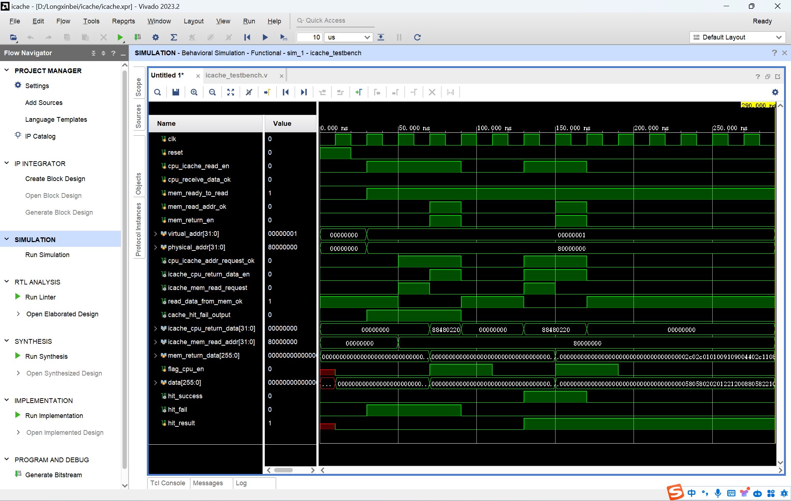
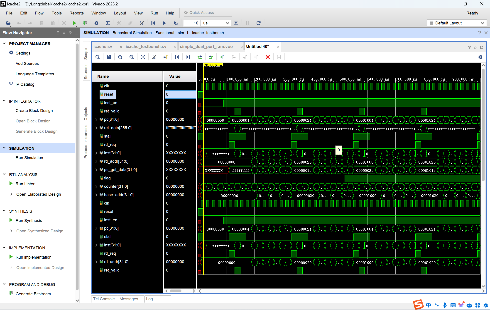
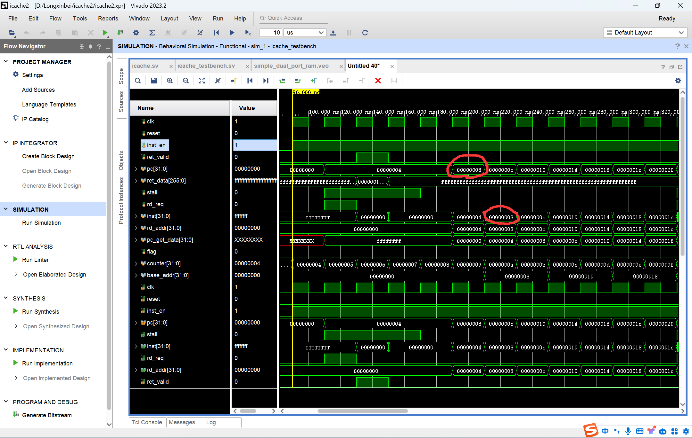
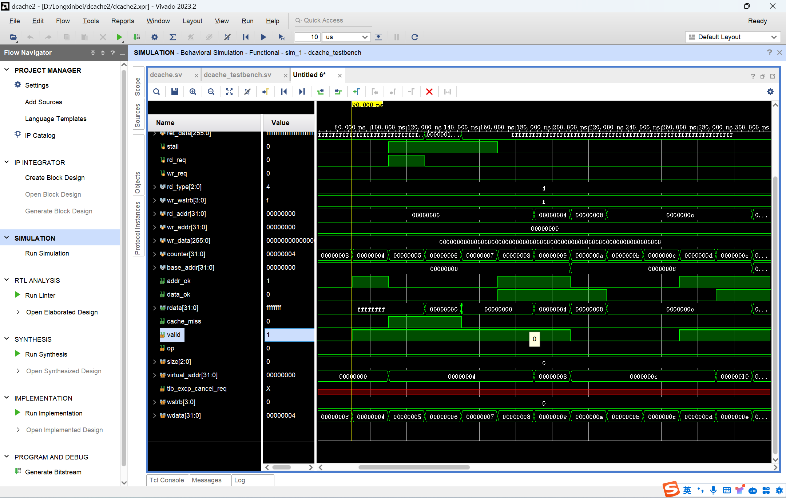

# Cache部分实现进展记录

## 2024-4-3更新
1. 学习了Cache的基础知识，对Cache是什么，有什么作用，如何实现，有哪些优化方法等方面有了深刻的了解
2. 找到了一些实现Cache的代码，针对代码进行学习，对理论应用到实践有了较为深刻的体会，从他人的代码中掌握了一些实现Cache的技巧。具体学习材料如下：
   1. basic_cache中，basic_icache和basic_dcache这两个文件为Cache的基础状态机实现，来自chiplab的gitee链接。目前已将basic_icache中的代码详细的分析了一遍，学会了Cache的基本状态机实现
   2. MIPS2020CODE为学长在github上开源的代码，这个项目的Cache做的很出色，有详细的设计文档辅助理解，且优化采用流水线Cache。是学习Cache设计的极佳材料。
3. 目前做的事：设计Cache。进行designIdeas.md的编写，想清楚Cache的设计细节，对Cache中的优化方法进行设计。
4. ***目前的问题：多级Cache如何实现？L1Cache为什么能比L2Cache快？硬件用的一样怎么会有速度区别呢？***

## 2024-4-7更新
1. 参考basic_icache.v和icache_pipline.v学习了icache的基本组成，代码实现方式和代码实现技巧。
2. 新建mycache文件夹，设计icache并更新设计文档，完成了代码编写。
3. 当前为icache第一版本，采用状态机实现，不追求性能，只求在这个实践的过程对cache有深入全面的理解。目前已经按照理解完成icache代码编写，纠正所有的语法错误，编写简单的testbench.v，找到了一些问题，正在debug中。
4. 目前的问题：
   1. cpu设计方面：
      - [ ] **虚拟地址和物理地址不理解！这个映射是得我们来约定吗？两个地址分别是用来干什么的？什么时候传的是虚拟地址（物理地址）**
      - [ ] 所有的接口该确定了，应该对着接口写了，并明确这些接口信息的变化，什么时候为高电平，什么时候变回低电平？
      - [ ] 写代码注意时序！大多数都是组合逻辑电路assign，所有同步处理都会拖延时间？？？？？
   2. 代码编写方面：
      - [ ] 需要有统一的代码编写规范吗？
      - [ ] verilog经验分享(reset_n的使用，下降沿？如何减少错误率？如何写testbench)

## 2024-4-11更新
1. 根据理解重新对icache的接口进行定义，重新对icache的状态进行定义。主要增加了**ok反馈信号**，即模块间通信时，每次的信号成功接收都会返回ok信号，根据这个信号可以将en使能信号重新变回低电平，从而方便进行下一个信号发出时，en重新变为高电平，实现信号的连续传输。
2. 重写icache，想清楚状态转移和信号在这个过程中的变化，做到思路清晰地去写代码，注释详细，便于理解维护。

## 2024-4-12更新
1. 对icache编写测试文件icache_testbench.v并进行debug。经过短暂的纠错后，**icache已成功通过测试**，实现预期功能！！！
   

## 2024-4-14更新
1. 4-13到4-14两天理解dcache，设计接口，耗时整整一天完成dcache部分代码的编写。其实第一次尝试写dcache总还是有很多没考虑到的地方，以为有了icache的实现经验之后写dcache会是一件很简单的事，但是还是会遇到一些困难。脏位的处理，很多信号的assign赋值条件突然变得巨多！！！不知道有没有考虑周到(心累)。最痛苦的还得是写到最后阶段时发现对于writebuffer的设计太模糊！！！导致很多接口的赋值不知道该怎么赋。未来需要对writebuffer的职责界定清晰，若需要将buffer命中的数据返回给dcache再给cpu则考虑两种设计：
   1. 增加dcache与buffer的接口，并改变很多状态变化和赋值的逻辑，基本=dcache重写
   2. 写一个新的高层模块，对dcache和buffer的信号进行整合调度
2. 写两天verilog真的要吐了，晚上觉得来劲了很有动力，就一直写，小熬了点夜晚上有没睡好，这第二天看到代码真的想吐，效率太低了，以后干啥都还是不能影响晚上睡觉啊！！！！！！！
3. 总的来说，dcache的第一版实现啦！

## 2024-4-23更新
1. 学习地址翻译模式，高质量博客：
   1. [text](https://www.51cto.com/article/745664.html)
   2. [text](https://foxsen.github.io/archbase/sec-privileged-ISA.html#sec-memory-management)
2. 学习龙芯架构的存储管理单元。主要参考手册
3. 学习TLB模块写法，参考代码：chitlab所提供的mycpu
4. 更新TLBIdeas.md，TLB设计思路文档。已经理解TLB的功能需求和设计思路。现在来看，TLB其实是一个很固定的模块，需要做的就是根据手册要求，实现对应的查表功能即可，没有什么优化空间，所以其实chiplab提供的TLB相关模块应该来说是非常好的，代码规范，严格按照相关要求实现，自己写很难有什么更好地点，感觉只能重构代码，没有思路上的改进。
5. 龙芯TLB模块的特点：
   1. 指令地址翻译与数据地址翻译分开同步进行
   2. 页表奇偶分开查找，双页号
   3. 对TLB表各个部分的定义，比较部分和物理转换部分
6. 近期想法：
   1. 看手册还应该是很重要的一部分，看看手册对这部分有没有什么要求。光看其他的改进代码容易写偏(LoongArch和其他指令集的区别就在于这些接口等的要求？)，到最后基础要求都没实现。应该是先实现基础要求再优化？
   2. 我还没将代码改成SystemVerilog，我觉得想先看看大家改代码的经验教教我我再改。
      1. 第一个问题是改代码的优越性在哪？接口等功能用的还是很少？我感觉看起来最吸引我的点在于结构体这个点！但是这会要求我们互相之间的代码接口的地方对结构体有相同的定义？是不是要统一！
      2. 第二个问题是这次改代码想将icache改成能对接双发射的，想看看前端取址有什么新理解。
      3. 对如何将cache改成流水线还是有点没头绪，icache不用改成流水线，dcache由于检查tag和写dcache不能保证再同一个时钟周期内执行完，可改成流水线。(《超标量设计》阅读心得)

## 2024-4-30更新
1. 实现了icache，使用IP核的BRAM作为存储器，对接上了所有时序。
2. 目前问题：
   1. 从mem返回数据使用的256位，未来对接axi时需要将代码改成8个周期接收32*8个信号，或者在上层模块中实现
   2. 有小毛刺，但所剩毛刺我认为不会影响功能，一部分被stall掉了，另一部分因为posedge clk接收不会影响。

## 2024-5-3更新
1. 对icache进行改进，根据前端需求，添加返回信号
2. 完成dcache，并通过测试